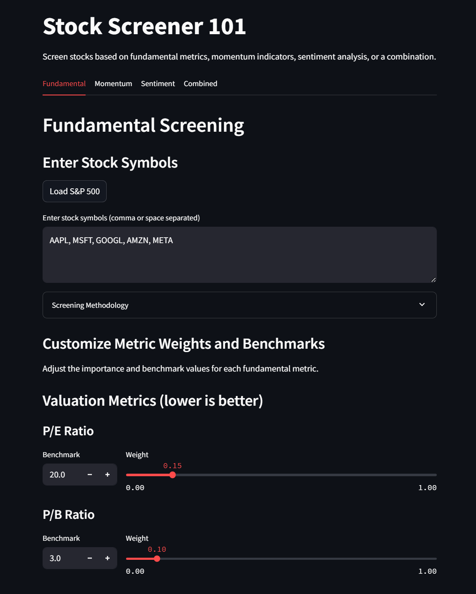

# Algo-Trading Sentiment: Multi-Factor Stock Screener

This project implements a stock screening tool that evaluates equities based on a combination of fundamental analysis, technical momentum indicators, and NLP-driven sentiment analysis of financial news.

 <!-- Example with width set -->

## Core Features

*   **Multi-Factor Analysis**: Scores stocks using:
    *   **Fundamental Metrics**: P/E Ratio, ROE, Debt-to-Equity, etc.
    *   **Technical Momentum**: RSI, MACD, Moving Averages (using `TA-Lib`).
    *   **Sentiment Analysis**: FinBERT model processing recent news headlines.
*   **Interactive UI (Streamlit)**:
    *   Select specific stocks or market indices for screening.
    *   Configure the weighting of fundamental, technical, and sentiment scores in the final evaluation.
    *   View individual scores or a combined, weighted score to inform investment decisions.
*   **Data Integration**: Utilises `yfinance` for market data and integrates news APIs for sentiment analysis inputs.

## Purpose

This tool is designed to provide a quantitative framework for stock evaluation, allowing users to customise screening criteria based on their investment strategy. It serves as a portfolio project demonstrating skills in Python, data analysis (`pandas`), NLP (Transformers/FinBERT), technical analysis (`TA-Lib`), and web application development (`Streamlit`).

## Usage

1.  **Set up Environment**: Clone the repository and create the Conda environment using the provided file:
    ```bash
    conda env create -f environment.yml
    conda activate tradingenv
    ```
2.  **Run the Application**: Launch the Streamlit UI:
    ```bash
    streamlit run app.py
    ```
    This will open the stock screener interface in your web browser.